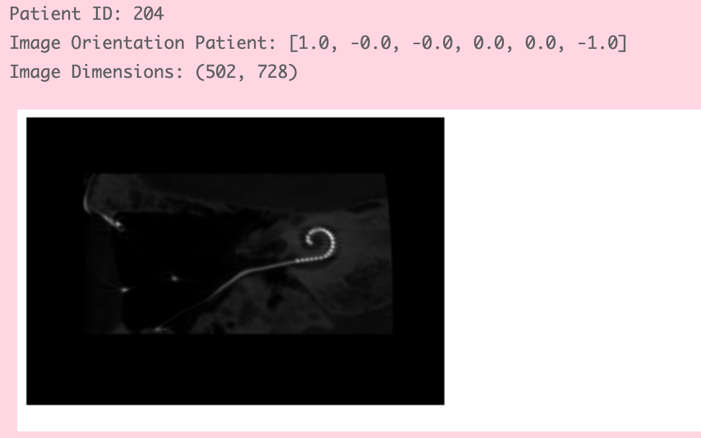

# Coclear_Segmentation
 

__Aim:__ Semantic Segmentation for cochlear implant from CBCT scans

__Data:__ De-identified CBCT scans of 66 patients, each folder cotains ~1000 DICOM files.

__Solution plan:__ 
1. Learn and load the data (completed)
2. Filter the interested data out. (completed)
3. Label Annotation (partially completed)
4. Preprocessing (completed)
5. Model training (now)
6. Fintune and standardise the model

 # Learn and load the data
 ## Image inspection
- load 1 DICOM, print the info, and see what can we do with it
- From this section, we know the tags they set, and we are interested in 
    - patient ID
    - ImageOrientationPatient
    - image dimensions
    - PixelData

## Filter
To create a function that processes all DICOM images in a given folder, checks their `ImageOrientationPatient` attribute, rounds its values to one decimal place, and duplicates the image to a specified folder if the orientation matches `(1,0,0,0,0,-1)`, we use the `pydicom` library for reading DICOM files and the `shutil` library for copying files.

Here is a step-by-step approach to write this function:

1. **Iterate Over All DICOM Files**: Read each DICOM file in the specified folder.

2. **Check `ImageOrientationPatient`**: Extract this attribute from each DICOM file, round the values to one decimal place, and check if it matches the specified orientation.

3. **Copy Matching Files**: If an image matches the criteria, duplicate it to the specified target folder.

---
__After those steps, we get 1700 images that show the coronal plane, where around 38 of that have clear electrode arrays. Now we start with the 38 images__
---

# Label Annotation
This step is to manually create the true masks for assisting model training. After this phrase, we are supposed to have PNG files that share the same filenames and the same size as the original images, where the pixels for the background are "0" and the pixels for the electrode array are "1". I used 2 methods: 
  1) Use `labelme` to generate masks in JSON format and then convert them into true masks.
  2) Directly use Python to write a GUI, that applies a threshold to filter out most unwanted whiteness, and then use black and pens to modify the mask, then convert to masks
