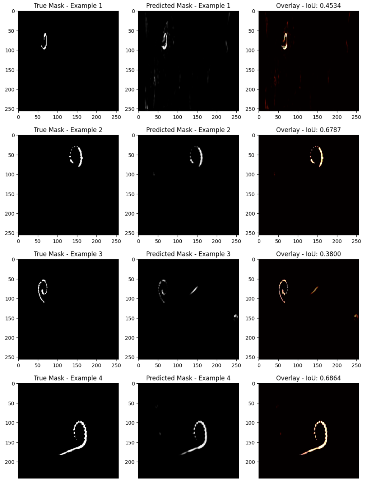

# Coclear_Segmentation
 

__Aim:__ Semantic Segmentation for cochlear implant from CBCT scans

__Data:__ De-identified CBCT scans of 66 patients, each folder cotains ~1000 DICOM files.

__Solution plan:__ 
1. Learn and load the data (completed)
2. Filter the interested data out. (completed)
3. Label Annotation (partially completed)
4. Preprocessing (completed)
5. Model training (now)
6. Fintune and standardise the model

 # Phase 1: Learn and load the data
 ## Image inspection
- load 1 DICOM, print the info, and see what can we do with it
- From this section, we know the tags they set, and we are interested in 
    - patient ID
    - ImageOrientationPatient
    - image dimensions
    - PixelData

## Filter: select all coronal images
To create a function that processes all DICOM images in a given folder, checks their `ImageOrientationPatient` attribute, rounds its values to one decimal place, and duplicates the image to a specified folder if the orientation matches `(1,0,0,0,0,-1)`, we use the `pydicom` library for reading DICOM files and the `shutil` library for copying files.

Here is a step-by-step approach to write this function:

1. **Iterate Over All DICOM Files**: Read each DICOM file in the specified folder.

2. **Check `ImageOrientationPatient`**: Extract this attribute from each DICOM file, round the values to one decimal place, and check if it matches the specified orientation.

3. **Copy Matching Files**: If an image matches the criteria, duplicate it to the specified target folder.

---
__After those steps, we get 1700 images that show the coronal plane, where around 38 of them have clear electrode arrays. Now we start with the 38 images__
---

# Phase 2: Label Annotation
This step is to manually create the true masks for assisting model training. After this phrase, we are supposed to have PNG files that share the same filenames and the same size as the original images, where the pixels for the background are "0" and the pixels for the electrode array are "1". I used 2 methods: 
  1) Use `labelme` to generate masks in JSON format and then convert them into true masks.
  2) Directly use Python to write a GUI, that applies a threshold to filter out most unwanted whiteness, and then use black and pens to modify the mask, then convert to masks

## Labelme Method
First, we manually mark all the labels in labelme.

We will have JSON files that store the label annotation information. Then we visualise and convert them to true masks. See working space:
- [Visualise true mask](https://github.com/Yunyaonate/coclear_segmentation/blob/main/Visualise_true_mask.ipynb), that visualise the mask we just annotated
- [Labelme mask batch](https://github.com/Yunyaonate/coclear_segmentation/blob/main/labelme_mask_batch.ipynb), that covert all the JSON files to mask together

## Python-GUI method
Manually marking every single electrode is painful and could be inaccurate. Thus we create a GUI that uses a threshold filter to find the light area and allow users to manually edit the filtered images with black and white pens, then convert the images into masks. This method is much more effective than using labelme.

The GUI window shows as below:

For details, please see working space:
- [Mask generator](https://github.com/Yunyaonate/coclear_segmentation/blob/main/mask_generator.ipynb), where filters most unwanted parts out, and wait for edition, then convert the edited images to mask
- [label GUI](https://github.com/Yunyaonate/coclear_segmentation/blob/main/label_gui.py), where create the GUI

The mask generated by manual annotation (left) and code-supervised annotation (right) are shown below:

---
Now we have the 38 images with clear electrode arrays and 38 masks that store the annotation as binary images (0 / 255 for easier visualisation) in PNG format. They are ready for model training
---

# Phase 3: Data Preparation and Model Training

## 1. Data Preparation

__Cropping:__ Using Otsu's thresholding to isolate the cochlear region in each image.

__Resizing:__ Standardizing the size of the cropped images to 256x256 pixels to ensure consistency in input dimensions for the U-Net model.

- Details in [Data Preparation](https://github.com/Yunyaonate/coclear_segmentation/blob/main/data_preperation.ipynb)
- cropped and resized images and masks

  
## 2. Model Training

Code in: [Model Training](https://github.com/Yunyaonate/coclear_segmentation/blob/main/Model_training.ipynb)

### 1. Setting up the Environment
- Open Google Colab.
- Enable GPU for faster computation.
- Install TensorFlow if not already available.
- Mount Google Drive.
### 2. Data Preparation

__Splitting the Data:__ Use `sklearn.model_selection.train_test_split` to split our dataset into training, validation, and testing sets using an 8:1:1 ratio.

### 3. Define IoU Metric
**Accuracy Metric Limitations:**

- **Metric Choice:** Accuracy is often not a good metric for segmentation tasks, especially when there's a class imbalance (e.g., most of the image is background). In such cases, the model might learn to predict the most common class for all inputs, resulting in high accuracy but poor qualitative results.

- **Alternative Metrics:** Consider using other metrics more suitable for imbalance and segmentation tasks, such as the Intersection over Union (IoU), Dice coefficient, Precision, Recall, or F1 Score. These metrics provide a better understanding of how well the model is performing in terms of the actual area covered by predictions versus ground truth.

### 4. U-Net Model Architecture
Here is the U-Net Architecture we are using.

### 5. Data Augmentation

Since we only have 38 images, data augmentation is essential. 

__Data Loader Setup:__ Use `ImageDataGenerator` to augment our data (useful for training to prevent overfitting and to increase the dataset artificially).

No data augmentation vs. Data augmentation

### 6. Model Compilation and Training

- Have tried multiple batch sizes and epochs, and found that batch size = 1, epochs = 100 demo the best result. 
- Also set checkpoint and early stopper, however, it would accidentally stop early because of the fluctuation of the curve.
- There's not much change after epoch 30, however, we can still see some flaws in the predicted mask. We need more training data.
- Output result (U-Net, Batch size = 1, epochs = 100):

